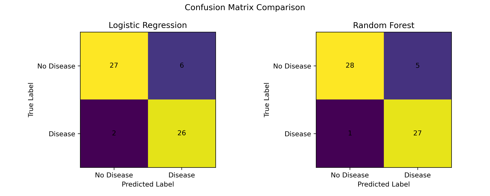
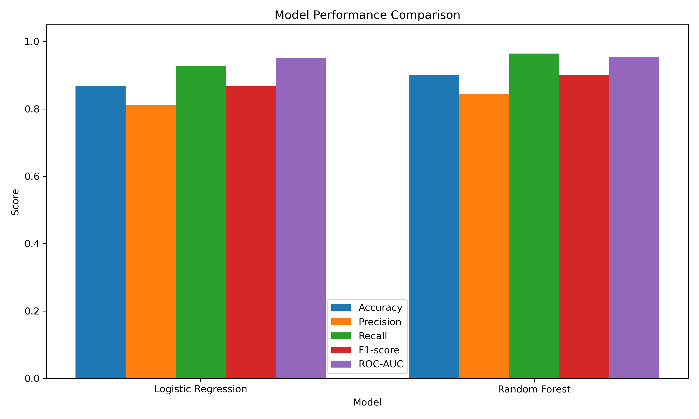

# Heart Disease Prediction Using Machine Learning

## Abstract

Heart disease is one of the major health concerns worldwide, making early risk prediction an important area of research. This study investigates the use of machine learning models for predicting the presence of heart disease using clinical patient data. The study uses the UCI Heart Disease dataset and applies data preprocessing techniques, including handling missing values, feature preparation, and stratified train-test splitting. Two supervised machine learning models, Logistic Regression and Random Forest, are trained and evaluated. Model performance is assessed using accuracy, precision, recall, and F1-score. The experimental results provide a comparison of the predictive performance of the two models and demonstrate the potential of machine learning for supporting heart disease risk prediction. The findings also highlight the importance of appropriate preprocessing and model evaluation when working with clinical datasets.

## 1. Introduction

Heart disease is a major health concern and early identification of individuals at risk can support timely clinical assessment and treatment. Machine learning has been increasingly investigated for heart disease prediction because it can learn patterns from clinical data and use these patterns to classify patients according to their risk or disease status. The UCI Heart Disease dataset is a commonly used dataset for this type of classification problem and contains clinical attributes that can be used to predict the presence of heart disease.

Previous studies have investigated several machine learning techniques for heart disease classification. The literature reviewed for this study shows that models such as Logistic Regression, Random Forest, Support Vector Machine, and K-Nearest Neighbors can be applied to structured clinical data. Research comparing different machine learning approaches also demonstrates that model performance can vary depending on the characteristics of the dataset, preprocessing procedures, and evaluation methods. These findings motivate the comparison of multiple machine learning models rather than relying on a single algorithm.

This study focuses on predicting the presence of heart disease using the UCI Heart Disease dataset. Logistic Regression and Random Forest are selected as the two classification models for the experiment. The data are preprocessed before model training, and the models are evaluated using accuracy, precision, recall, and F1-score.

The research question addressed in this study is: **How effectively can Logistic Regression and Random Forest predict the presence of heart disease using the UCI Heart Disease dataset?** The study aims to compare the performance of these two models and examine their potential for heart disease prediction using structured clinical data.

Methodology

1. Research Question

Can machine learning models predict the presence of heart disease using clinical features from the UCI Heart Disease dataset?

2. Dataset Description

The UCI Heart Disease dataset contains 303 patient records and 13 input features. The features include age, sex, chest pain type, resting blood pressure, cholesterol, fasting blood sugar, resting electrocardiographic results, maximum heart rate, exercise-induced angina, ST depression, slope, number of major vessels, and thalassemia-related information.

The target variable represents the diagnosis of heart disease. For this experiment, the target will be converted into a binary classification problem:

0 = absence of heart disease
1 = presence of heart disease
The dataset contains both numerical and categorical variables. Some variables contain missing values, particularly the ca and thal features.

3. Data Cleaning Plan

The following preprocessing steps will be performed:

Load the UCI Heart Disease dataset.
Check the dataset shape and data types.
Identify missing values.
Replace missing values using median imputation.
Convert the target into binary form.
Separate input features from the target variable.
Split the data into training and testing sets.
Use stratified splitting to maintain similar class proportions in both sets.
Standardize features for Logistic Regression.

4. Feature Engineering

The original clinical variables will be used as model features. No unnecessary features will be created because the dataset is relatively small.

Categorical variables are represented numerically in the UCI dataset. Numerical feature scaling will be applied for Logistic Regression because it can help the model operate more consistently when variables have different numerical ranges.

Random Forest does not require feature scaling, but the experiment will use an appropriate preprocessing pipeline to avoid data leakage.

5. Train-Test Split

The dataset will be divided into:

80% training data
20% testing data
A fixed random state will be used so that the experiment is reproducible.

6. Machine Learning Models

Two machine learning classification models will be trained.

Logistic Regression

Logistic Regression will be used as a baseline classification model. It is suitable for binary classification and provides a relatively simple model for comparison.

Random Forest

Random Forest will be used as a second model. It combines multiple decision trees and can model nonlinear relationships between clinical features and the target.

Using two different algorithms allows their performance to be compared on the same test data.

7. Evaluation Metrics

The models will be evaluated using:

Accuracy
Precision
Recall
F1-score
ROC-AUC
Confusion Matrix
Accuracy measures the overall proportion of correct predictions. Precision measures the proportion of predicted positive cases that are actually positive. Recall measures how many actual positive cases are correctly identified. F1-score combines precision and recall. ROC-AUC measures the model's ability to distinguish between the two classes.

8. Limitations

The dataset is relatively small, containing 303 records. Therefore, model performance may vary depending on the train-test split. The dataset also represents a limited population and should not be treated as sufficient for clinical deployment. The experiment is intended for educational machine-learning research rather than medical diagnosis.

9. Expected Outcome

The experiment will compare Logistic Regression and Random Forest using the same dataset and evaluation metrics. The final conclusion will be based on the measured test-set results rather than assuming that one model will perform better before the experiment is conducted.

## 3. Results

The performance of Logistic Regression and Random Forest was evaluated using the same test dataset. The models were compared using accuracy, precision, recall, F1-score, and ROC-AUC.

Logistic Regression achieved an accuracy of 0.8689, precision of 0.8125, recall of 0.9286, F1-score of 0.8667, and ROC-AUC of 0.9513. Random Forest achieved an accuracy of 0.9016, precision of 0.8438, recall of 0.9643, F1-score of 0.9000, and ROC-AUC of 0.9545.

### Table 1. Model Performance Comparison

| Model | Accuracy | Precision | Recall | F1-score | ROC-AUC |
|---|---:|---:|---:|---:|---:|
| Logistic Regression | 0.8689 | 0.8125 | 0.8286 | 0.8667 | 0.9513 |
| Random Forest | 0.9016 | 0.8438 | 0.9643 | 0.9000 | 0.9545 |

### Table 2. Confusion Matrix Values

| Model | True Negatives | False Positives | False Negatives | True Positives |
|---|---:|---:|---:|---:|
| Logistic Regression | 27 | 6 | 2 | 26 |
| Random Forest | 28 | 5 | 1 | 27 |

### Figure 1. Confusion Matrix Comparison

The confusion matrices show the numbers of correct and incorrect predictions made by both models. Logistic Regression produced 27 true negatives, 6 false positives, 2 false negatives, and 26 true positives. Random Forest produced 28 true negatives, 5 false positives, 1 false negative, and 27 true positives.

### Figure 2. Model Performance Comparison

The performance comparison shows the differences between Logistic Regression and Random Forest across accuracy, precision, recall, F1-score, and ROC-AUC.

## 4. Discussion

The experimental results show that both Logistic Regression and Random Forest were able to predict the presence or absence of heart disease using the clinical features in the UCI Heart Disease dataset. Random Forest achieved higher values for accuracy, precision, recall, F1-score, and ROC-AUC than Logistic Regression in this experiment.

The confusion matrices provide additional information about the prediction errors. Logistic Regression produced 27 true negatives, 6 false positives, 2 false negatives, and 26 true positives. Random Forest produced 28 true negatives, 5 false positives, 1 false negative, and 27 true positives. Therefore, Random Forest made fewer incorrect predictions on the test dataset.

The ROC-AUC values were also high for both models. Logistic Regression achieved a ROC-AUC of 0.9513, while Random Forest achieved 0.9545. These results indicate that both models were able to distinguish between the two target classes effectively on the test data.

However, the results should be interpreted with caution. The UCI Heart Disease dataset contains only 303 records, and the models were evaluated using a single 80/20 train-test split. Therefore, the reported performance may vary with a different data split. The dataset also represents a limited population and is not sufficient for clinical deployment. The results of this study should therefore be considered an educational machine-learning experiment rather than a clinical diagnostic system.

## 5. Conclusion

This study investigated the application of machine learning models for predicting the presence of heart disease using the UCI Heart Disease dataset. Logistic Regression and Random Forest were trained using the preprocessed clinical features and evaluated on the same test dataset.

Logistic Regression achieved an accuracy of 86.89% and a ROC-AUC of 95.13%, while Random Forest achieved an accuracy of 90.16% and a ROC-AUC of 95.45% in this experiment. The results show that both models were able to classify the presence and absence of heart disease using the selected clinical features.

Although the models produced promising results on the test dataset, the small dataset size and single train-test split limit the generalizability of the findings. Future work could use larger datasets, cross-validation, additional machine learning algorithms, and more extensive feature engineering to further investigate heart disease prediction.

Overall, this project demonstrates how machine learning can be applied to structured clinical data for an educational heart disease prediction task. The results should not be interpreted as a substitute for professional medical diagnosis.

## 6. References

1. UCI Machine Learning Repository. Heart Disease Dataset. University of California, Irvine. Available at: https://archive.ics.uci.edu/dataset/45/heart+disease

2. Nasution et al. (2025). Heart disease prediction using machine learning algorithms. https://doi.org/10.25299/ijtrd.2025.17941

3. Muhammad, Y., Tahir, M., Hayat, M., et al. (2020). Early and accurate detection and diagnosis of heart disease using intelligent computational model. Scientific Reports, 10, 19747. https://doi.org/10.1038/s41598-020-76635-9